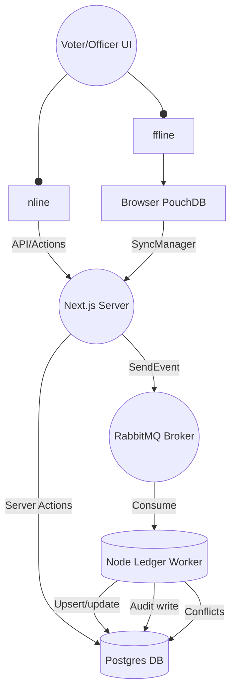
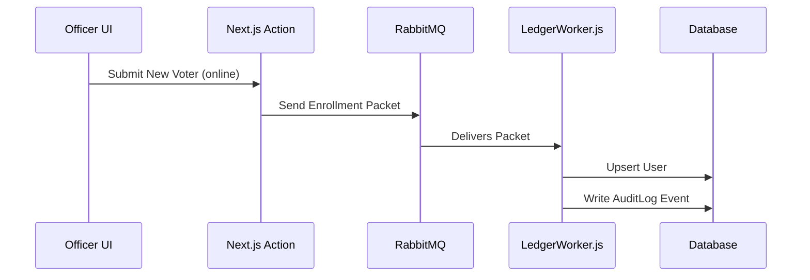

# V-LINK — Architecture Overview

## 1. High-Level System Diagram

---

## 2. Main Features and Data Flows

### A. Offline-First Capture
- **UI saves events to PouchDB if offline** — buffered until reconnected
- **SyncManager** detects network and syncs batch data automatically
- **Code:** `src/lib/pouchdb.js`, `src/components/SyncManager.tsx`

### B. Online Event Processing
- Officer/Voter submits form → Next.js server action
- If online, request is immediately packetized and sent to **RabbitMQ**
  - **Code:** `src/actions/officer.js`, `src/actions/sync.js`
- **Worker service** listens for RabbitMQ messages and performs:
    - Versioned atomic upserts (voter registration/update)
    - Hash chain audit log write
    - Crypto payload encryption
    - Conflict detection (CAS failures go to ConflictLog)
  - **Code:** `src/workers/ledgerWorker.js`

### C. Admin Features: Ledger, Audit, Privacy
- **Admin Dashboard** provides:
    - Ledger integrity checks (hash chain verification)
    - Conflict resolution (manual intervention)
    - Privacy module (AES key shredding for GDPR/RTBF)
- **Code:** `src/app/admin/audit/page.jsx`, `src/app/admin/conflicts/page.jsx`, `src/app/admin/privacy/page.jsx`

---

## 3. Component Map & Responsibility

| Layer              | Technology      | Files                                     | Purpose                                  |
|--------------------|----------------|-------------------------------------------|------------------------------------------|
| Web UI (SPA + SSR)| Next.js        | `src/app/...`                             | User/admin interfaces                    |
| State buffer      | PouchDB        | `src/lib/pouchdb.js`                      | Offline-first in-browser DB              |
| Server Actions    | Next.js 15     | `src/actions/*.js`                        | Secure endpointless mutation API         |
| Queue             | RabbitMQ       | `RabbitMQ` service, `src/lib/rabbitmq.js` | Async event queuing                      |
| Event Worker      | Node.js        | `src/workers/ledgerWorker.js`             | Processes queue, handles all DB writes   |
| Database          | PostgreSQL     | `prisma/schema.prisma`                    | All data, versioning, logs, shredded keys|
| ORM/Client        | Prisma         | `src/lib/db.js`                           | All DB access                            |
| Security          | Crypto         | `src/lib/encryption.js`                   | AES-256-GCM encryption for payload/key   |

---

## 4. Major Flows — Sequence Diagram (Enrollment)

---

## 5. Feature Index (for dev/testing)

- Dual-mode (online/offline): Yes (SyncManager + PouchDB)
- Conflict detection/resolution: Yes (CAS via version, ConflictLog, admin UI)
- End-to-end auditability: Yes (Ledger, hash chaining)
- Privacy w/ right-to-be-forgotten: Yes (AES key shredding)
- Hash-chain/ledger verification: Yes (admin action)
- Role distinctions: admin, officer, voter (Access controlled UI + schema)
- Dead letter/disaster queue: Yes (RabbitMQ DLQ, see ledgerWorker.js)

---

**See also:** `CODE_FLOW_AND_FEATURES.md` for file-by-file trace, and `TESTING_GUIDE.md` for click-by-click scenarios.

