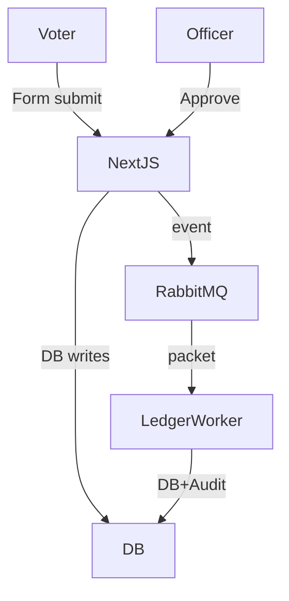
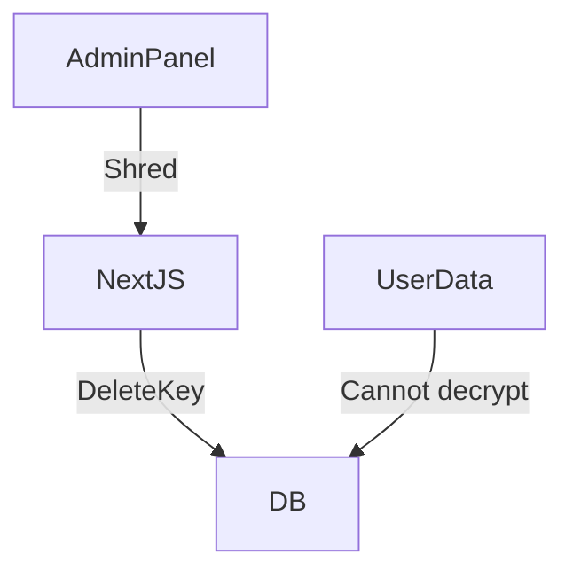
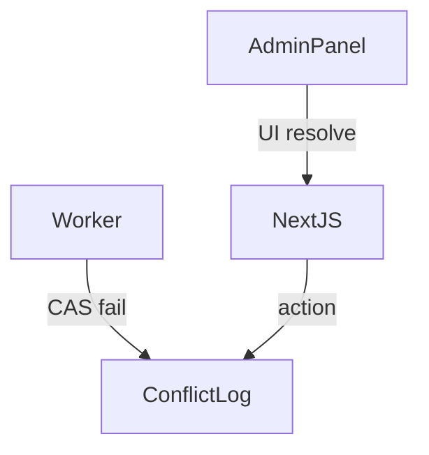

# V-LINK — Testing Guide

## 1. Before You Start
- **Have Docker (or local RabbitMQ), PostgreSQL, and Node.js installed.**
- See the `SETUP_AND_TESTING.md` for full environment setup and initial credentials.

---

## 2. Test User Credentials
| Role    | Identifier     | Password      |
|---------|---------------|--------------|
| Admin   | ADMIN-001     | password123  |
| Officer | OFFICER-402   | password123  |
| Voter   | VLINK12345    | password123  |

---

## 3. Testing Scenarios

### Scenario A: Register a New Voter (Officer)
1. Go to `http://localhost:3000/officer` and login as Officer.
2. Fill out the enroll form with any valid values (offline or online).
3. If offline, registration is queued in your browser. When you reconnect or go online, it syncs automatically.
    - See code: `src/components/SyncManager.tsx` for auto-sync logic.
4. If online, voter is directly sent to the backend and appears in the database upon processing by the worker.
    - Check database with: `npm run db:studio`

### Scenario B: Voter Requests Relocation
1. Go to `http://localhost:3000/voter` and login as Voter.
2. Go to "Relocate" tab and choose a new constituency.
3. Submit. See a new pending RelocationRequest in the database.

### Scenario C: Officer Approves Relocation
1. As Officer, go to "Update" tab.
2. Enter Voter's EPIC (e.g. VLINK12345) and update the constituency to match the pending relocation.
3. Submit. The change will be committed via RabbitMQ/worker.
4. Confirm: Request becomes PROCESSING/AUDITED in the DB.

### Scenario D: Admin Exams
#### 1. Ledger Integrity
- Login as Admin at `/admin`.
- Go to Ledger tab.
- Click "Verify Chain Integrity" to run hash check.
#### 2. Conflicts
- If a DB version mismatch occurs, see the /admin/conflicts page. Perform a retry or discard.
#### 3. Privacy Shredding
- In Privacy, enter EPIC, click "Shred Data"; verify by checking the encryption_keys table for absence of the key.

### Scenario E: Offline/Sync Buffering
1. Go offline (or stop RabbitMQ).
2. Register a voter as Officer.
3. Go back online. Wait 30 seconds or refresh. Registration auto-syncs (submitEventBatch triggered by SyncManager).

---

## 4. End-to-End Feature Test Checklist
- [ ] Enroll new voter online - appears in DB users table, audited
- [ ] Enroll new voter offline - appears in browser buffer, syncs later
- [ ] Voter can create relocation request - RelocationRequest appears as PENDING
- [ ] Officer can approve/commit relocation - status moves to PROCESSING and new ledger event is written
- [ ] Admin can:
    - [ ] Verify hash chain from ledger
    - [ ] See/resolve conflicts
    - [ ] Shred a voter's data
- [ ] All audit log entries are encrypted (not readable plaintext)
- [ ] DLQ and ConflictLog are populated if worker fails or version CAS error occurs

---

## 5. Troubleshooting
- If a page crashes or errors out, check the browser console and Node.js terminal output.
- Make sure all services are running (see ports 3000, 5432, 5672, and 15672).
- For SSR/React hydration issues, ensure you’re not trying to use browser-only APIs on the server.
- For DB errors (`table ... does not exist`), run:
  ```bash
  npm run db:migrate      # (creates & migrates DB tables)
  npm run db:seed         # (loads admin, officer, voter)
  npm run db:studio       # (to visually confirm records)
  ```
- For RabbitMQ errors, check Docker logs or localhost RabbitMQ management dashboard at `http://localhost:15672`.

---

## 6. Visual Flow (feature-by-feature)

### Enrollment
```mermaid
graph TD
    OfficerForm-->|(online)| NextJS-->|event| RabbitMQ-->|packet| LedgerWorker-->|DB+Audit| DB[(Database)]
    OfficerForm-->|(offline)| PouchDB-. SyncManager .-> NextJS
```

### Relocation


### Privacy


### Conflict


---

**See also:**
- [ARCHITECTURE_OVERVIEW.md](ARCHITECTURE_OVERVIEW.md)
- [CODE_FLOW_AND_FEATURES.md](CODE_FLOW_AND_FEATURES.md)

